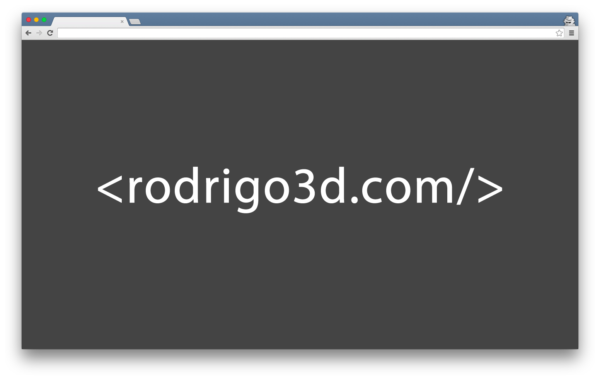

# [RODRIGO3D.COM](https://rodrigo3d.com)

[Bare](http://startbootstrap.com/template-overviews/bare/) é um modelo HTML inicial para o [Bootstrap](http://getbootstrap.com/) criado por [Start Bootstrap](http://startbootstrap.com/). Esse modelo apresenta caminhos de arquivo predefinidos para Bootstrap e jQuery, para que você possa criar rapidamente sites do Bootstrap.

#

**[Visualização ao vivo](https://rodrigo3d.com)**

## Status

## Download and Installation

To begin using this template, choose one of the following options to get started:
* [Download the latest release on Start Bootstrap](https://startbootstrap.com/template-overviews/bare/)
* Install via npm: `npm i startbootstrap-bare`
* Clone the repo: `git clone https://github.com/BlackrockDigital/startbootstrap-bare.git`
* [Fork, Clone, or Download on GitHub](https://github.com/BlackrockDigital/startbootstrap-bare)

## Usage

### Basic Usage

After downloading, simply edit the HTML and CSS files included with the template in your favorite text editor to make changes. These are the only files you need to worry about, you can ignore everything else! To preview the changes you make to the code, you can open the `index.html` file in your web browser.

### Advanced Usage

After installation, run `npm install` and then run `gulp dev` which will open up a preview of the template in your default browser, watch for changes to core template files, and live reload the browser when changes are saved. You can view the `gulpfile.js` to see which tasks are included with the dev environment.

## Bugs and Issues

Have a bug or an issue with this template? [Open a new issue](https://github.com/BlackrockDigital/startbootstrap-bare/issues) here on GitHub or leave a comment on the [template overview page at Start Bootstrap](http://startbootstrap.com/template-overviews/bare/).

## Custom Builds

You can hire Start Bootstrap to create a custom build of any template, or create something from scratch using Bootstrap. For more information, visit the **[custom design services page](https://startbootstrap.com/bootstrap-design-services/)**.

## Sobre

Start Bootstrap is an open source library of free Bootstrap templates and themes. All of the free templates and themes on Start Bootstrap are released under the MIT license, which means you can use them for any purpose, even for commercial projects.

* https://startbootstrap.com
* https://twitter.com/SBootstrap

Start Bootstrap was created by and is maintained by **[David Miller](http://davidmiller.io/)**, Owner of [Blackrock Digital](http://blackrockdigital.io/).

* http://davidmiller.io
* https://twitter.com/davidmillerskt
* https://github.com/davidtmiller

Start Bootstrap is based on the [Bootstrap](http://getbootstrap.com/) framework created by [Mark Otto](https://twitter.com/mdo) and [Jacob Thorton](https://twitter.com/fat).

## Direitos Autorais e Licença

Copyright 2013-2018 RODRIGO3D.COM. Código liberado sob o [MIT](https://github.com/rodrigo3d/rodrigo3d.com/blob/master/LICENSE.md) license.
